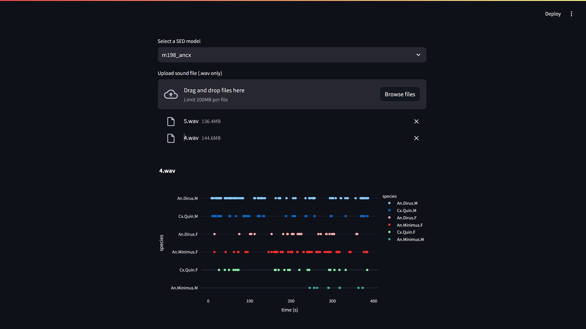

# MosWing Streamlit

## Install Dependencies

We only tested on python 3.10.12, however the python official website does not provide an installer for this version. So, we suggest you install from conda and install the rest of dependencies in pip.

```
conda create -n moswing python=3.10.12
conda activate moswing
pip install -r requirements.txt
```

## Run

```
streamlit run main.py
```

Note: There is a constrain that the model only works on the sound with length modulo of 10 (10s, 20s, 30s). If the sound with non-modulo of 10 is present, the model will cut of the non-divisible duration of the sound and only predict on the first divisible chunk. For instance, the sound with 105 seconds will be used by the model only 100 seconds and leave the 5 seconds untouch.

## Webpage on Action

Users can select the model setting in the top dropdown and select sound files (specifically .wav files) to the file uploader.


After the sound has been uploaded, the model will give prediction in the interactive plot with x-axis is time and y-axis represents species (x, y). If the dot is present in (17, An.Dirus.M), meaning the model predicted that there is (an) anopheles mosquito(es) presents at 17 seconds in the recording.


